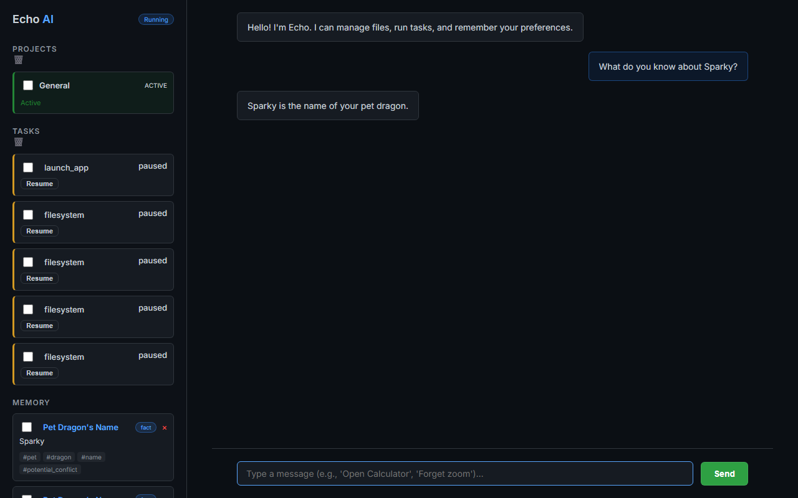

# Echo: Identity-Aware AI Assistant


*(Add a screenshot here of the chat interface showing memory recall)*

**Echo** is a next-generation local AI assistant designed to **remember**. Unlike standard chatbots that reset every session, Echo builds a persistent understanding of you—your preferences, facts, and habits—using a custom Retrieval-Augmented Generation (RAG) engine.

It doesn't just chat; it learns.

---

## 🧠 Core Capabilities

### 1. Long-Term Memory (The "Cortex")
Echo uses a local persistent memory store to retain information indefinitely.
- **Fact Extraction**: Automatically parsing conversations to save key details (e.g., *"I have a pet dragon named Sparky"*).
- **Cross-Session Recall**: Remember context from days or weeks ago.
- **Conflict Resolution**: Smartly handles changing information (e.g., updating your favorite food).

### 2. Adaptive RAG Engine
Powered by semantic search and re-ranking models (`TinyBERT`), Echo retrieves only the most relevant memories for every interaction.
- **Contextual Awareness**: Understads "it", "that", and "him" based on history.
- **Smart Filtering**: Distinguishes between casual chat and factual statements.

### 3. Cognitive Planning
Echo doesn't guess. It plans.
- **Multi-Step Reasoning**: Breaks down complex requests into logical steps.
- **Verification**: Validates actions before executing them.

---

## 📸 Gallery


*Active memory recall in the sidebar*

### Adaptive Personality
*(Add screenshot: Echo adjusting its tone based on learned preferences)*

---

## 🛠️ Technology Stack

- ** LLM**: Groq API / Local LLMs (via Ollama)
- **Memory**: Custom JSON-based Vector Store
- **RAG**: `sentence-transformers` + `cross-encoder` (TinyBERT)
- **Backend**: FastAPI (Python)
- **Frontend**: Vanilla JS + CSS (Clean, dark-mode interface)

---

## 🚀 Getting Started

### Prerequisites
- Python 3.10+
- A Groq API Key (or local LLM setup)

### Installation

1. **Clone the Repository**
   ```bash
   git clone https://github.com/Gauravguddeti/relayX.git
   cd relayX
   ```

2. **Setup Virtual Environment**
   ```bash
   python -m venv .venv
   .\.venv\Scripts\activate
   ```

3. **Install Dependencies**
   ```bash
   pip install -r requirements.txt
   ```

4. **Run the Brain**
   ```bash
   uvicorn app.main:app --host 127.0.0.1 --port 8000
   ```

---

*Echo is an evolving project exploring the boundaries of local AI memory and agency.*
